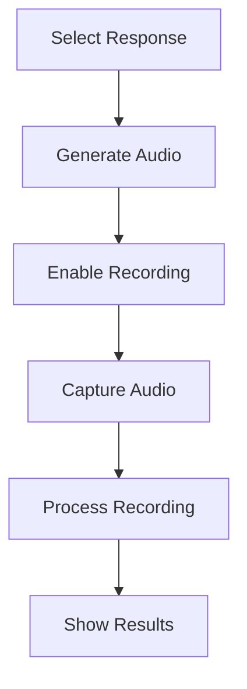

# Pronunciation Assessment Flow

## Overview

The pronunciation assessment system allows users to:
1. Select a response to practice
2. Listen to reference audio
3. Record their pronunciation
4. Submit for assessment
5. View detailed feedback

## Component Flow



## Key Components

### AudioRecorder
```typescript
interface AudioRecorderProps {
  onRecordingComplete: (blob: Blob) => void;
  isProcessing: boolean;
}
```

### PronunciationModal
```typescript
interface PronunciationModalProps {
  isOpen: boolean;
  onClose: () => void;
  response: {
    text: string;
    translation: string;
    audio_url?: string;
  };
  onSubmit: (score: number, audioBlob?: Blob) => void;
  isProcessing: boolean;
}
```

## Assessment Process

1. **Audio Capture**:
   - WAV format
   - 16kHz sample rate
   - Single channel
   - Noise reduction

2. **Submission**:
   - Send to Azure Speech Services
   - Include reference text
   - Process results

3. **Results Format**:
```typescript
interface AssessmentResult {
  pronunciationScore: number;
  accuracyScore: number;
  fluencyScore: number;
  completenessScore: number;
  words: WordAssessment[];
}
```

## Error Handling

1. **Recording Issues**:
   - Microphone access
   - Audio quality
   - Browser support

2. **Processing Errors**:
   - Service availability
   - Network issues
   - Format validation

3. **Recovery Steps**:
   - Reset state
   - Clear invalid data
   - Show user feedback