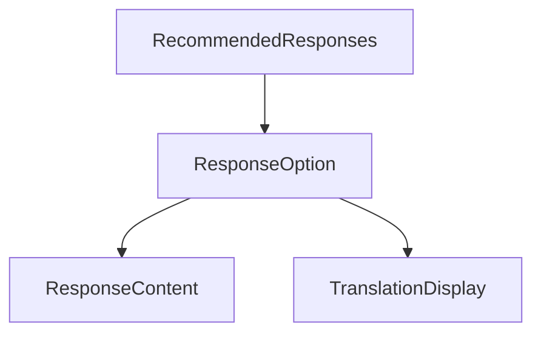

# Recommended Responses Flow

## Overview

The recommended responses system provides AI-generated response options for users during guided conversations.

## Component Structure



## Response Generation

### Trigger Points
1. Initial conversation start
2. After user selects response
3. Manual refresh (if needed)

### Generation Process
1. Fetch conversation context
2. Call edge function
3. Format responses
4. Update UI

## Response Format

```typescript
interface Response {
  id: string;
  text: string;
  translation: string;
  hint?: string;
  audio_url?: string;
  languageCode?: string;
}
```

## State Management

### Loading States
1. Initial loading
2. Audio generation
3. Response processing

### Error States
1. Generation failures
2. Audio failures
3. Network issues

## User Experience

1. Display Options:
   - Primary text
   - Translation
   - Optional hint
   - Loading states

2. Interaction:
   - Selection
   - Audio preview
   - Practice mode

3. Feedback:
   - Loading indicators
   - Error messages
   - Success states

## Performance

1. Caching:
   - Response caching
   - Audio caching
   - State persistence

2. Optimization:
   - Lazy loading
   - State batching
   - Error boundaries