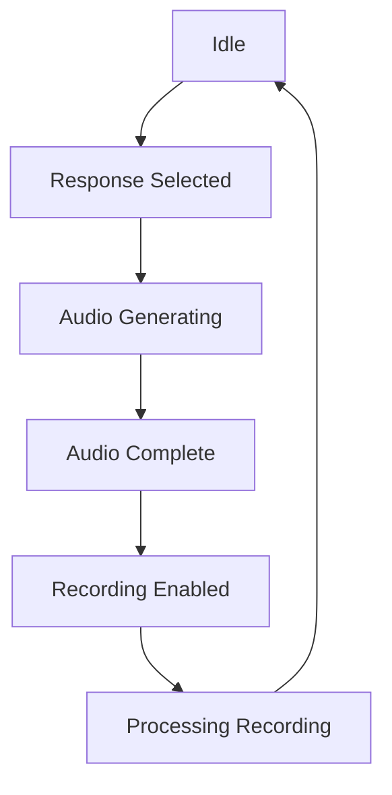
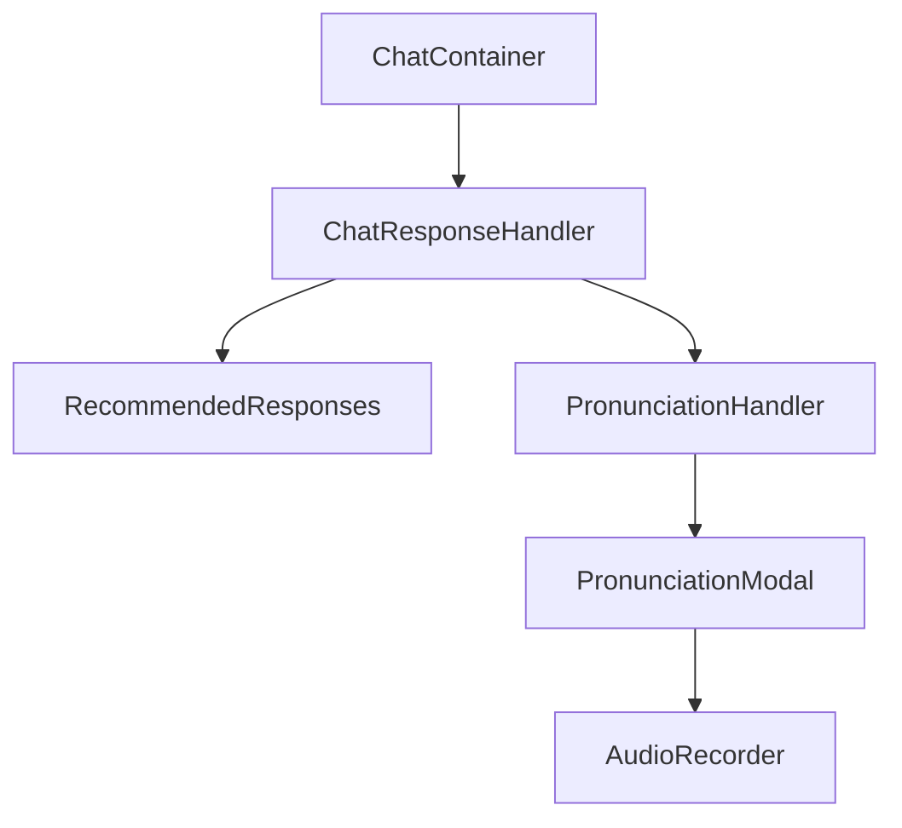

# Response Generation & Selection Flow

## Overview

The chat response flow manages the generation, selection, and processing of AI responses in guided conversations.

### State Management (`useResponseState.ts`)

1. **Key States**:
   - `selectedResponse`: Currently selected response
   - `isProcessing`: Overall processing state
   - `audioGenerationStatus`: Audio generation progress ('idle' | 'generating' | 'complete' | 'error')

2. **State Transitions**:


### Response Generation (`useResponseGeneration.ts`)

1. **Trigger Points**:
   - Initial conversation start
   - After user message sent
   - Manual refresh

2. **Generation Process**:
   - Fetches conversation context
   - Calls edge function
   - Returns formatted responses

3. **Response Format**:
```typescript
interface Response {
  id: string;
  text: string;
  translation: string;
  hint?: string;
  audio_url?: string;
  languageCode?: string;
}
```

### Audio Generation (`useTTS.ts`)

1. **Generation Flow**:
   - Check memory cache
   - Check database cache
   - Generate new audio if needed
   - Store in both caches

2. **Error Handling**:
   - Network failures
   - Invalid language settings
   - Audio generation errors

### Pronunciation Practice (`usePronunciationHandler.ts`)

1. **Recording Flow**:
   - Enable recording after audio generation
   - Capture user audio
   - Submit for assessment
   - Display results

2. **State Management**:
   - Track recording state
   - Handle audio processing
   - Manage assessment results

## Component Hierarchy



## Debug Points

Key console logs for tracking flow:
1. Response selection: "handleResponseSelect - Starting with response:"
2. Audio generation: "startAudioGeneration - Setting status to generating"
3. Processing state: "startProcessing - Setting processing to true"
4. State reset: "resetState - Resetting all states"