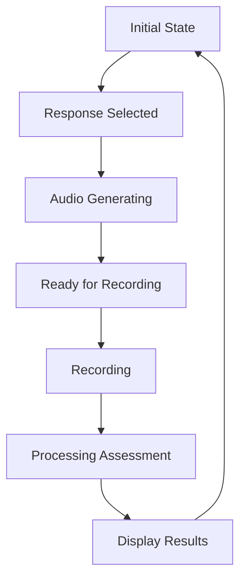

# Chat State Management Documentation

## Core States

### Response State
```typescript
interface ResponseState {
  selectedResponse: Response | null;
  isProcessing: boolean;
  audioGenerationStatus: 'idle' | 'generating' | 'complete' | 'error';
}
```

### Processing States
1. **Audio Generation**:
   - Tracks TTS generation progress
   - Manages caching status
   - Handles errors

2. **Recording**:
   - Tracks microphone access
   - Manages recording status
   - Handles audio processing

3. **Assessment**:
   - Tracks submission status
   - Manages results processing
   - Handles feedback display

## State Flow



## Debug Points

### Console Logging
```typescript
// Response selection
console.log('handleResponseSelect - Starting with response:', response);

// Audio generation
console.log('startAudioGeneration - Setting status to generating');

// Processing state
console.log('startProcessing - Setting processing to true');

// State reset
console.log('resetState - Resetting all states');
```

## Error Recovery

1. **Audio Generation Failures**:
   - Reset to idle state
   - Clear processing flags
   - Show error toast

2. **Recording Failures**:
   - Reset recording state
   - Clear audio data
   - Show error message

3. **Assessment Failures**:
   - Reset to initial state
   - Preserve recording
   - Allow retry